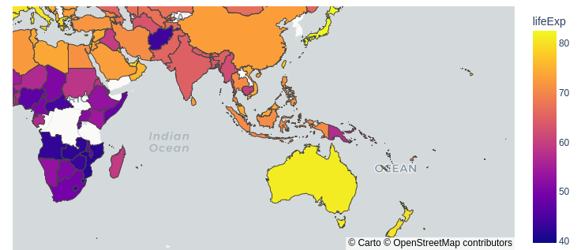

# DashDemo
This is a little dash-app demo to help with productionising dashboards and visualisations organisation-wide.

## Installation
1. Clone the repository
2. Install the requirements

```bash
pip install -r requirements.txt
```
3. Run the app

```bash
python app.py
```
4. Open the app in your browser at `http://127.0.0.1:8050/`
